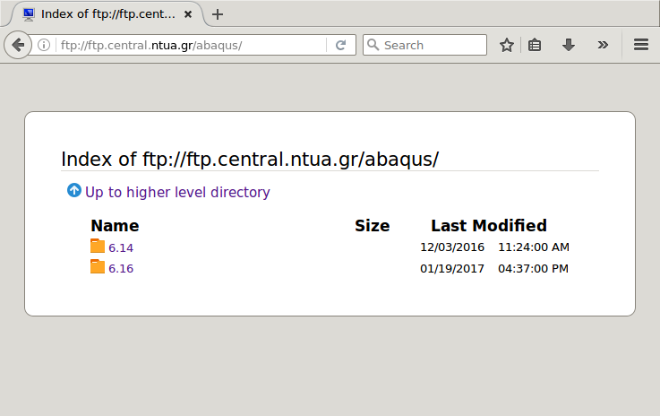
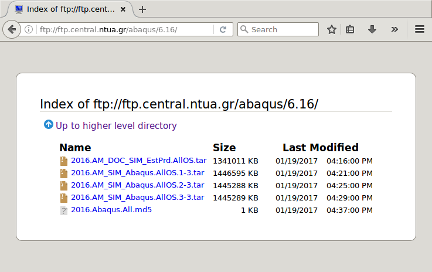
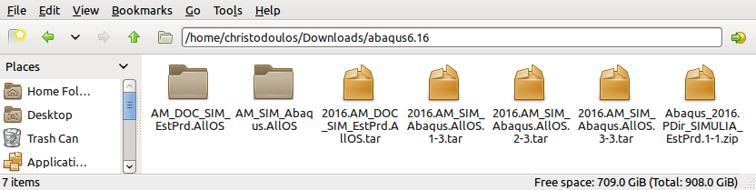
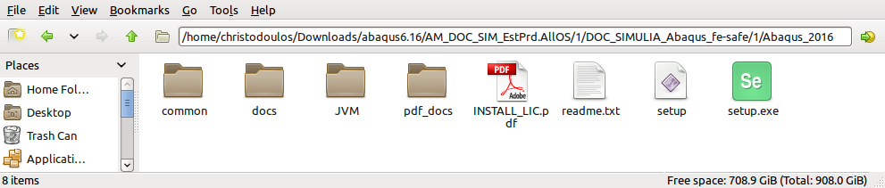

ABAQUS
======

## Γενικά για το Αbaqus

## Διαθέσιμες Άδειες

## Download των λογισμικών

Τα λογισμικά της Dassault Systemes που συνθέτουν τη σουΐτα του Abaqus είναι διαθέσιμα μετά από έλεγχο πρόσβασης στον ftp server του Κέντρου Ηλεκτρονικών Υπολογιστών `ftp.central.ntua.gr`. Μετά τον επιτυχή έλεγχο πρόσβασης επιλέγετε την έκδοση που σας ενδιαφέρει και μεταφορτώνετε στον υπολογιστή σας τα αρχεία `.tar`. Για τον έλεγχο της ορθότητας των αρχείων που κατεβάσατε χρησιμοποιήστε το αρχείο με τα `md5 sums`.

Τα ίδια αρχεία μπορούν να χρησιμοποιηθούν για εγκατάσταση τόσο σε πλατφόρμα Windows όσο και σε πλατφόρμα Linux.

Σας συνιστούμε να αποθηκεύσετε τα αρχεία σε κάποιο κατάλογο και να τα αποσυμπιέσετε σε αυτόν όποτε να δημιουργηθούν δύο κατάλογοι. Στον ένα κατάλογο `AM_DOC_SIM_EstPrd.AllOS` βρίσκεται το Documentation ενώ στο άλλο κατάλογο `AM_SIM_Abaqus.AllOS` βρίσκονται τα προγράμματα.

Hint: Ξεκινήστε με την εγκατάσταση του Documentation γιατί αυτό είναι απαραίτητο για την αποτελεσματική πρόσβαση στη βοήθεια μέσα από το πρόγραμμα.

## Documentation

Ξεκινήστε την εγκατάσταση επιλέγοντας το κατάλληλο αρχείο για την πλατφόρμα σας από τον παρακάτω κατάλογο:

Η εγκατάσταση είναι μια απλή σειρά αποδοχής των εξορισμού επιλογών εκτός από την 5η εικόνα όπου θα πρέπει να συμπληρώσετε το όνομα του υπολογιστή σας ή τη λέξη `localhost`.

To Documentation θα είναι προσβάσιμο μέσω κάποιου webbrowser στην τοπική πόρτα `2180` ή στο `http://localhost:2180/v2016/index.html`:

Solvers
-------

CAE
---

